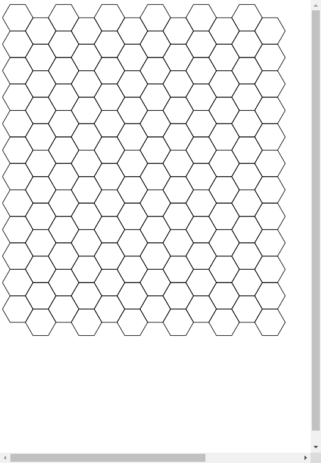

# DrawHexGrid

A simple tool to draw hex grid.

Here is the sample:

## TODO

- add parameter inputs, e.g. size, color, line width etc.
- support background
- different grid style.

## dev

This tool is pretty simple currently , not much to say.

## build

Assuming you've installed Node and NPM.

- `npm install`

  This step may have some problem, due to package `paper`'s post-install script(I'm not sure). It could not run in Windows's console. So find a proper terminal or build in Linux.

- Download `paper` and `jquery` lib files and put them in `scripts` directory.

- `webpack`

- Now you can find the generated `bundle.js` in 'build' directory.

